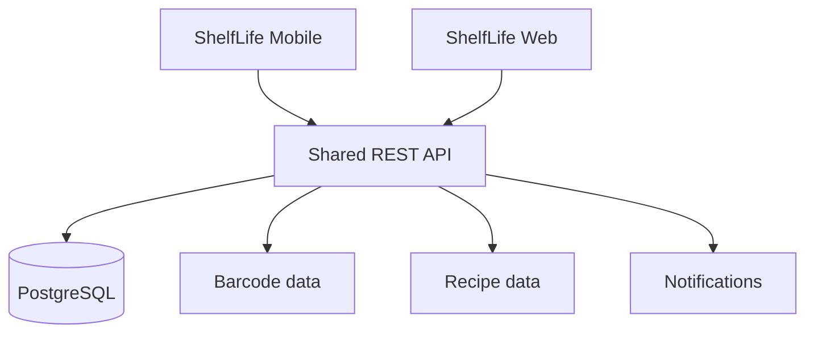

<div align="center">

# 📱 ShelfLife Mobile

**A React Native food-inventory app that helps users see what they have and what needs to be used soon.**


</div>

ShelfLife Mobile is the mobile companion to the ShelfLife web project.

The app focuses on making food inventory easy to check from a phone, with expiry-date awareness built directly into the experience.

## What it currently does

The mobile project includes:

- an inventory screen
- reusable food cards
- food-item models
- inventory display logic
- expiry-date calculations
- date helper utilities

The goal is to keep the app simple enough to use quickly while still providing useful information about food freshness.

## How it is structured

```text
src/
├── components/
│   └── FoodCard.tsx
├── features/
│   └── inventory/
│       ├── inventoryDisplay.ts
│       └── inventoryLogic.ts
├── models/
│   └── FoodItem.ts
├── screens/
│   └── InventoryScreen.tsx
└── utils/
    └── dateHelpers.ts
```

This keeps UI components, business logic and data models separate rather than putting everything inside one screen.

## How expiry information works

The application uses food expiry dates to determine how items should be presented to the user.

The idea is to make it easy to identify:

```text
Fresh items
Items that should be used soon
Expired items
```

As the project grows, that logic will become the basis for reminders and food-waste recommendations.

## Run the app

Install dependencies:

```bash
npm install
```

Start Expo:

```bash
npx expo start
```

You can then run the project using an emulator or a supported mobile device.

## Where ShelfLife is going

The mobile app will eventually connect to the same backend as ShelfLife Web.



That would allow a household to update its food inventory from either a browser or a phone.

## Planned features

- barcode scanning
- shared household inventory
- push notifications
- expiry reminders
- recipe suggestions
- shopping-list generation
- food-waste statistics
- synchronisation with ShelfLife Web

## Why I built it

I wanted ShelfLife to be more than a desktop-style web application.

Food inventory is something people often need while standing in the kitchen or shopping in a store, so a mobile version makes sense for the problem.

Building both clients also gives me a chance to learn how multiple frontends can share the same backend and domain model.

## Tech stack

| Area | Technology |
|---|---|
| **Mobile framework** | React Native |
| **Development platform** | Expo |
| **Language** | TypeScript |
| **Current focus** | Inventory and expiry tracking |
| **Planned backend** | Shared REST API |

## What's next

- [ ] Connect the app to a real backend
- [ ] Share inventory data with ShelfLife Web
- [ ] Add barcode scanning
- [ ] Add expiry notifications
- [ ] Add food-entry forms
- [ ] Add household accounts
- [ ] Add recipe suggestions
- [ ] Add automated tests
- [ ] Add screenshots and a mobile demo

---

<p align="center">Built by <a href="https://github.com/ZinhleHlongwane">Zinhle Hlongwane</a> · Johannesburg 🇿🇦 · <a href="https://www.linkedin.com/in/zinhle-hlongwane-872354209">LinkedIn</a></p>
